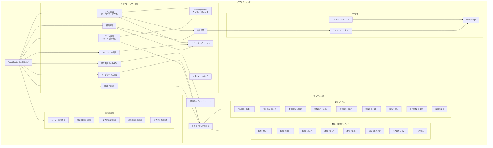
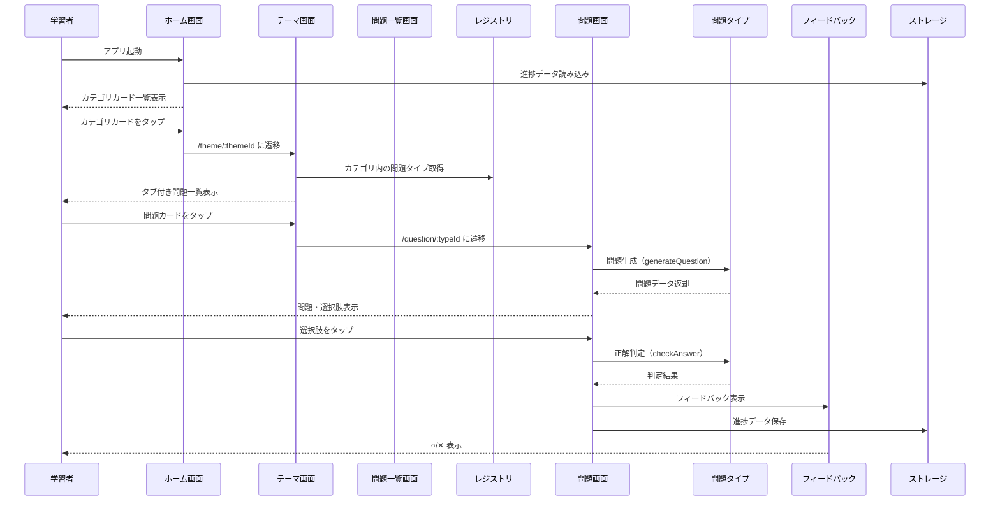
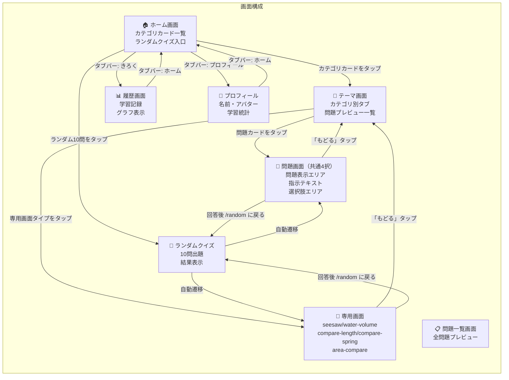
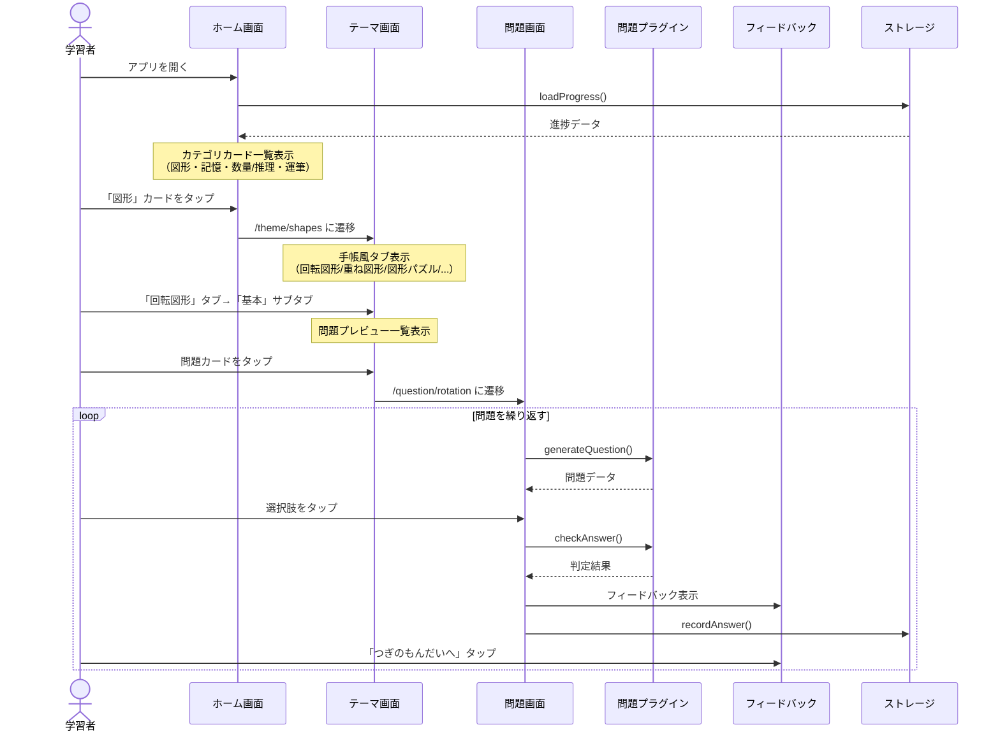
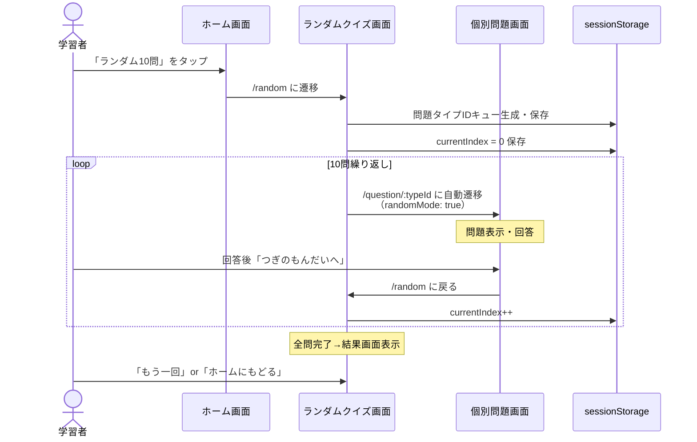
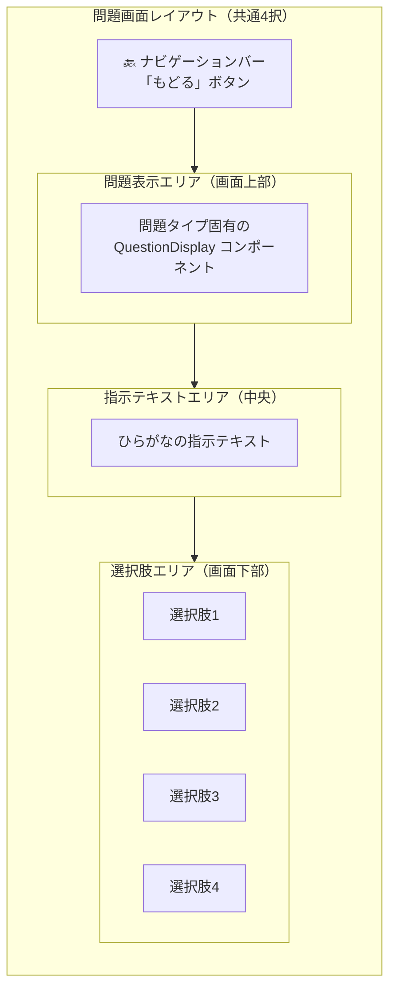
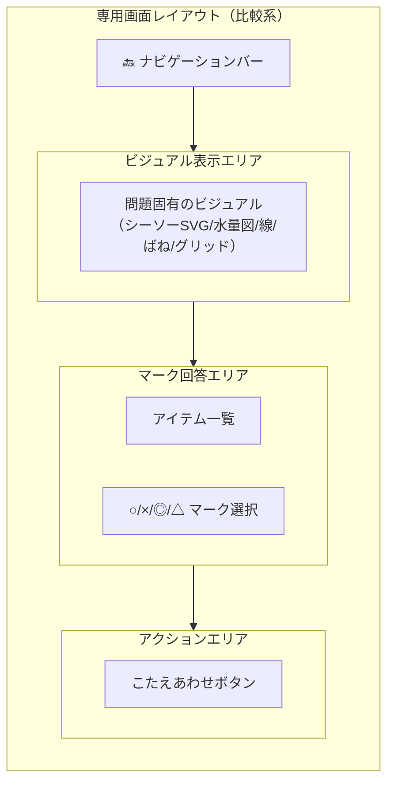
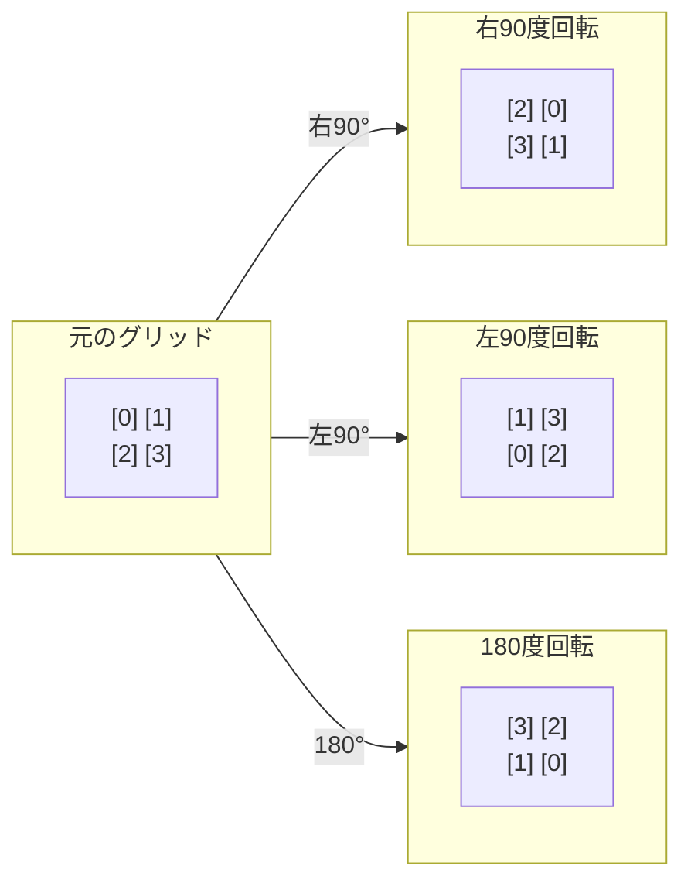
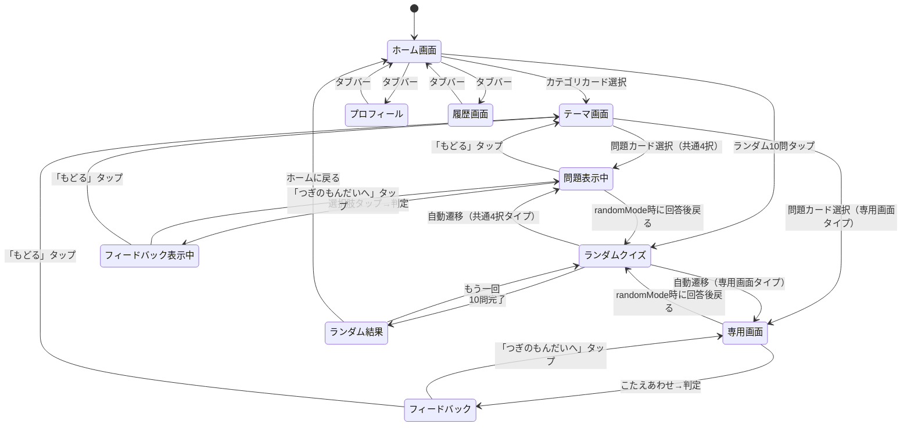

# 設計ドキュメント: 小学校受験問題練習アプリ

## 概要（Overview）

本アプリケーションは、国立小学校受験レベルの問題を幼稚園児が練習できるブラウザベースのSPA（Single Page Application）である。React + TypeScript で構築し、サーバサイドを必要としない完全なフロントエンドアプリケーションとして動作する。

### 設計思想

1. **プラグインアーキテクチャ**: 問題タイプを独立したモジュールとして実装し、共通フレームワークから分離する
2. **幼稚園児ファースト**: すべてのUI/UXは幼稚園児が直感的に操作できることを最優先とする
3. **段階的拡張**: 問題タイプを順次追加し、カリキュラムに沿った学習体験を構築する
4. **オフライン完結**: localStorage によるデータ永続化のみを使用し、ネットワーク通信を一切行わない
5. **カテゴリ・グループ化**: 問題タイプをカテゴリ（図形・記憶・数量/推理・運筆）で分類し、関連する問題をグループ化して段階的に学習できる構造

### 技術スタック

| カテゴリ | 技術 | 理由 |
|---------|------|------|
| フレームワーク | React 19 | コンポーネントベースのUI構築、豊富なエコシステム |
| 言語 | TypeScript | 型安全性によるプラグインインターフェースの厳密な定義 |
| ビルドツール | Vite | 高速な開発サーバーとビルド |
| UIライブラリ | Chakra UI v3 | アクセシブルなコンポーネント、レスポンシブ対応 |
| ルーティング | React Router v7 (HashRouter) | SPA内のページ遷移、GitHub Pages対応 |
| テスト | Vitest + React Testing Library | Viteとの統合、高速なテスト実行 |
| PBTライブラリ | fast-check | TypeScript対応のプロパティベーステスト |
| E2Eテスト | Playwright | ブラウザ自動テスト |
| デプロイ | GitHub Pages + GitHub Actions | mainブランチへのpushで自動デプロイ |

---

## アーキテクチャ（Architecture）

### High-Level アーキテクチャ



### Low-Level アーキテクチャ: データフロー



### 画面遷移図



### ユーザー操作フロー: カテゴリ→テーマ→問題



### ユーザー操作フロー: ランダムクイズ



### ルーティング構成

```typescript
// App.tsx
<HashRouter>
  <Routes>
    <Route path="/" element={<HomeScreen />} />
    <Route path="/theme/:themeId" element={<ThemeScreen />} />
    <Route path="/questions/:typeId" element={<QuestionListScreen />} />
    <Route path="/question/seesaw" element={<SeesawScreen />} />
    <Route path="/question/water-volume" element={<WaterVolumeScreen />} />
    <Route path="/question/compare-length" element={<CompareLengthScreen />} />
    <Route path="/question/compare-spring" element={<CompareSpringScreen />} />
    <Route path="/question/area-compare" element={<AreaCompareScreen />} />
    <Route path="/question/:typeId" element={<QuestionScreen />} />
    <Route path="/profile" element={<ProfileScreen />} />
    <Route path="/random" element={<RandomQuizScreen />} />
    <Route path="/history" element={<HistoryScreen />} />
  </Routes>
</HashRouter>
```

| パス | 画面 | 説明 |
|------|------|------|
| `/` | HomeScreen | カテゴリカード一覧、ランダムクイズ入口 |
| `/theme/:themeId` | ThemeScreen | カテゴリ別テーマ画面（タブ付き問題一覧） |
| `/questions/:typeId` | QuestionListScreen | 問題タイプ別の問題一覧画面 |
| `/question/seesaw` | SeesawScreen | シーソー問題専用画面 |
| `/question/water-volume` | WaterVolumeScreen | 水量比較問題専用画面 |
| `/question/compare-length` | CompareLengthScreen | 長さ比較問題専用画面 |
| `/question/compare-spring` | CompareSpringScreen | ばね比較問題専用画面 |
| `/question/area-compare` | AreaCompareScreen | 広さ比較問題専用画面 |
| `/question/:typeId` | QuestionScreen | 共通4択問題画面 |
| `/profile` | ProfileScreen | プロフィール設定・学習統計 |
| `/random` | RandomQuizScreen | 全問題タイプからランダム10問 |
| `/history` | HistoryScreen | 学習履歴・グラフ表示 |

### 実装済み問題タイプ一覧

| ID | 表示名 | アイコン | カテゴリ | グループ | 問題数 | 画面 | 概要 |
|----|--------|---------|---------|---------|--------|------|------|
| `rotation` | 回転図形（基本） | 🔄 | 図形 | 回転図形 | ランダム生成 | 共通4択 | 2×2グリッドの回転操作に関する4択問題 |
| `symbol-rotation` | 回転図形（応用） | 🎯 | 図形 | 回転図形 | 固定32問 | 共通4択 | 2×2グリッドにシンボル（丸、三角、四角、矢印、トランプマーク等）を配置した回転問題 |
| `overlay` | 重ね図形（基本） | 🔲 | 図形 | 重ね図形 | ランダム生成 | 共通4択 | 左列を右列に折り重ねた結果を選ぶ4択問題 |
| `overlay-advanced` | 重ね図形（応用） | 🔲 | 図形 | 重ね図形 | 固定8問 | 共通4択 | 3×3グリッドの○重なり問題（AND演算） |
| `overlay-shape` | 重ね図形（図形） | 🔲 | 図形 | 重ね図形 | 固定4問 | 共通4択 | 白黒パターン（三角形・四角形のSVGポリゴン）を重ねる問題 |
| `line-overlay` | 重ね図形（線） | 📐 | 図形 | 重ね図形 | ランダム生成 | 共通4択 | 4×4ドットグリッド上の線図形を2つ重ねた結果を答える問題 |
| `puzzle` | 図形パズル | 🧩 | 図形 | — | ランダム生成 | 共通4択 | 2つのピースを合わせてお手本を作る4択問題 |
| `overlay-cancel` | 折り重ね（相殺） | 🔲 | 図形 | — | ランダム生成 | 共通4択 | グリッドを折り重ね、○と×が相殺するルール付き4択問題 |
| `odd-one-out` | 異図形発見 | 🔍 | 図形 | — | ランダム生成 | 共通4択 | 並んだ図形の中から1つだけ違うものを見つける問題 |
| `seesaw` | 比較（重さ） | ⚖️ | 数量・推理 | 比較 | 固定4問 | 専用画面 | シーソーの傾きから重さの関係を推理し、○×マークで回答 |
| `water-volume` | 比較（水量） | 💧 | 数量・推理 | 比較 | 固定10問 | 専用画面 | コップ/水槽の水量を比較する○×マーク問題 |
| `compare-length` | 比較（長さ） | 📏 | 数量・推理 | 比較 | 固定4問 | 専用画面 | 線の長さを比較する○×マーク問題 |
| `compare-spring` | 比較（ばね） | 🔩 | 数量・推理 | 比較 | 固定4問 | 専用画面 | ばねの伸びで重さを比較する◎△×マーク問題 |
| `area-compare` | 比較（広さ） | ⬛ | 数量・推理 | 比較 | 固定10問 | 専用画面 | グリッド上の黒い部分の広さを比較する○×マーク問題 |
| `shape-karta` | 図形と数カルタ | 🎴 | 数量・推理 | — | ランダム生成 | 共通4択 | 複数条件の指示に一致するカードを4択から選ぶ問題 |
| `syllable-count` | 文字数あつまり | 🔤 | 数量・推理 | — | ランダム生成 | 共通4択 | 単語の文字数（音の数）と同じ人数のグループを選ぶ問題 |
| `one-to-one` | 1対1対応 | 🐤 | 数量・推理 | — | ランダム生成 | 共通4択 | 2種類のアイテムの過不足を問う問題 |

### カテゴリ構造

| カテゴリ | ID | 実装済み問題タイプ |
|---------|----|--------------------|
| 図形 | `shapes` | rotation, symbol-rotation, overlay, overlay-advanced, overlay-shape, line-overlay, puzzle, overlay-cancel, odd-one-out |
| 記憶 | `memory` | （未実装） |
| 数量・推理 | `math-reasoning` | seesaw, water-volume, compare-length, compare-spring, area-compare, shape-karta, syllable-count, one-to-one |
| 運筆 | `writing` | （未実装） |

### グループ化

同じカテゴリ内で関連する問題タイプはグループ化され、テーマ画面でタブ→サブタブとして表示される:

| グループ名 | 含まれる問題タイプ |
|-----------|-------------------|
| 回転図形 | rotation（基本）, symbol-rotation（応用） |
| 重ね図形 | overlay（基本）, overlay-advanced（応用）, overlay-shape（図形）, line-overlay（線） |
| 比較 | seesaw（重さ）, water-volume（水量）, compare-length（長さ）, compare-spring（ばね）, area-compare（広さ） |


### ディレクトリ構成

```
src/
├── main.tsx                          # エントリポイント（プラグイン登録）
├── App.tsx                           # ルーティング設定（HashRouter）
├── types/
│   └── question.ts                   # 問題タイプインターフェース定義
├── registry/
│   └── questionTypeRegistry.ts       # 問題タイプレジストリ
├── components/
│   └── ui/
│       └── provider.tsx              # Chakra UI プロバイダー
├── framework/
│   ├── categoryData.ts               # カテゴリ・単元の定義データ（一元管理）
│   ├── components/
│   │   ├── HomeScreen.tsx            # ホーム画面（カテゴリカード方式）
│   │   ├── ThemeScreen.tsx           # テーマ画面（カテゴリ別タブ・問題一覧）
│   │   ├── QuestionListScreen.tsx    # 問題一覧画面（全問表示 or ランダム生成）
│   │   ├── QuestionScreen.tsx        # 問題画面（共通4択レイアウト）
│   │   ├── RandomQuizScreen.tsx      # ランダムクイズ画面（10問モード）
│   │   ├── ProfileScreen.tsx         # プロフィール画面
│   │   ├── FeedbackOverlay.tsx       # 結果フィードバック表示
│   │   ├── NavigationBar.tsx         # ナビゲーションバー
│   │   ├── TabBar.tsx                # タブバーナビゲーション
│   │   ├── HistoryScreen.tsx         # 履歴画面（学習記録・グラフ）
│   │   └── Ruby.tsx                  # ルビ（ふりがな）コンポーネント
│   └── hooks/
│       ├── useProfile.ts             # プロフィールデータ管理フック
│       ├── useProgress.ts            # 進捗データ管理フック
│       └── useQuestionFlow.ts        # 問題出題フロー管理フック
├── plugins/
│   ├── rotation/
│   │   ├── index.ts                  # 回転図形（基本）登録エントリ
│   │   ├── symbolRotationIndex.ts    # 回転図形（応用）登録エントリ
│   │   ├── rotationQuestion.ts       # 基本：問題生成・正解判定ロジック
│   │   ├── symbolRotationQuestions.ts # 応用：固定32問データ
│   │   ├── components/
│   │   │   ├── GridDisplay.tsx        # グリッド表示コンポーネント
│   │   │   ├── QuestionDisplay.tsx    # 基本：問題表示
│   │   │   ├── ChoicesDisplay.tsx     # 基本：選択肢表示
│   │   │   ├── SymbolQuestionDisplay.tsx  # 応用：問題表示
│   │   │   └── SymbolChoiceDisplay.tsx    # 応用：選択肢表示
│   │   └── types.ts                  # 回転図形問題固有の型定義
│   ├── overlay/
│   │   ├── index.ts                  # 重ね図形（基本）登録エントリ
│   │   ├── overlayQuestion.ts        # 問題生成・正解判定ロジック
│   │   ├── components/
│   │   │   ├── QuestionDisplay.tsx    # 問題表示
│   │   │   └── ChoiceDisplay.tsx      # 選択肢表示
│   │   └── types.ts                  # 型定義
│   ├── overlay-advanced/
│   │   ├── index.ts                  # 重ね図形（応用）登録エントリ
│   │   ├── overlayAdvancedQuestion.ts # 固定8問データ
│   │   ├── components/
│   │   │   ├── Grid3x3Display.tsx     # 3×3グリッド表示
│   │   │   ├── QuestionDisplay.tsx    # 問題表示
│   │   │   └── ChoiceDisplay.tsx      # 選択肢表示
│   │   └── types.ts                  # 型定義
│   ├── overlay-shape/
│   │   ├── index.ts                  # 重ね図形（図形）登録エントリ
│   │   ├── overlayShapeQuestion.ts   # 固定4問データ
│   │   ├── components/
│   │   │   ├── QuestionDisplay.tsx    # 問題表示（SVGポリゴン）
│   │   │   └── ChoiceDisplay.tsx      # 選択肢表示
│   │   └── types.ts                  # 型定義
│   ├── line-overlay/
│   │   ├── index.ts                  # 重ね図形（線）登録エントリ
│   │   ├── lineOverlayQuestion.ts    # 問題生成ロジック
│   │   ├── components/
│   │   │   ├── DotGrid.tsx            # 4×4ドットグリッド表示
│   │   │   ├── QuestionDisplay.tsx    # 問題表示
│   │   │   └── ChoiceDisplay.tsx      # 選択肢表示
│   │   └── types.ts                  # 型定義
│   ├── puzzle/
│   │   ├── index.ts                  # 図形パズル登録エントリ
│   │   ├── puzzleQuestion.ts         # 問題生成・正解判定ロジック
│   │   ├── components/
│   │   │   ├── QuestionDisplay.tsx    # 問題表示
│   │   │   └── ChoiceDisplay.tsx      # 選択肢表示
│   │   └── types.ts                  # 型定義
│   ├── overlay-cancel/
│   │   ├── index.ts                  # 折り重ね（相殺）登録エントリ
│   │   ├── overlayCancelQuestion.ts  # 問題生成・正解判定ロジック
│   │   ├── components/
│   │   │   ├── QuestionDisplay.tsx    # 左右グリッド表示
│   │   │   └── ChoiceDisplay.tsx      # 選択肢グリッド表示
│   │   └── types.ts                  # 型定義
│   ├── odd-one-out/
│   │   ├── index.ts                  # 異図形発見登録エントリ
│   │   ├── oddOneOutQuestion.ts      # 問題生成・正解判定ロジック
│   │   ├── components/
│   │   │   ├── QuestionDisplay.tsx    # グリッド表示
│   │   │   └── ChoiceDisplay.tsx      # 選択肢表示
│   │   └── types.ts                  # 型定義
│   ├── seesaw/
│   │   ├── index.ts                  # 比較（重さ）登録エントリ
│   │   ├── seesawQuestion.ts         # 固定4問データ・正解判定ロジック
│   │   ├── components/
│   │   │   ├── SeesawDisplay.tsx      # シーソーSVG表示
│   │   │   ├── SeesawScreen.tsx       # 専用画面（カスタムUI）
│   │   │   ├── QuestionDisplay.tsx    # 問題表示
│   │   │   └── ChoiceDisplay.tsx      # 回答UI（○/×マーク）
│   │   └── types.ts                  # 型定義
│   ├── water-volume/
│   │   ├── index.ts                  # 比較（水量）登録エントリ
│   │   ├── waterVolumeQuestion.ts    # 固定10問データ・正解判定ロジック
│   │   ├── components/
│   │   │   ├── WaterVolumeScreen.tsx  # 専用画面（カスタムUI）
│   │   │   ├── QuestionDisplay.tsx    # 問題表示
│   │   │   └── ChoiceDisplay.tsx      # 回答UI（○/×マーク）
│   │   └── types.ts                  # 型定義
│   ├── compare-length/
│   │   ├── index.ts                  # 比較（長さ）登録エントリ
│   │   ├── compareLengthQuestion.ts  # 固定4問データ・正解判定ロジック
│   │   ├── components/
│   │   │   ├── CompareLengthScreen.tsx # 専用画面（カスタムUI）
│   │   │   ├── LineDisplay.tsx        # 線の長さ表示
│   │   │   ├── QuestionDisplay.tsx    # 問題表示
│   │   │   └── ChoiceDisplay.tsx      # 回答UI（○/×マーク）
│   │   └── types.ts                  # 型定義
│   ├── compare-spring/
│   │   ├── index.ts                  # 比較（ばね）登録エントリ
│   │   ├── compareSpringQuestion.ts  # 固定4問データ・正解判定ロジック
│   │   ├── components/
│   │   │   ├── CompareSpringScreen.tsx # 専用画面（カスタムUI）
│   │   │   ├── SpringDisplay.tsx      # ばね表示
│   │   │   ├── QuestionDisplay.tsx    # 問題表示
│   │   │   └── ChoiceDisplay.tsx      # 回答UI（◎/△/×マーク）
│   │   └── types.ts                  # 型定義
│   ├── area-compare/
│   │   ├── index.ts                  # 比較（広さ）登録エントリ
│   │   ├── areaCompareQuestion.ts    # 固定10問データ・正解判定ロジック
│   │   ├── components/
│   │   │   ├── AreaCompareScreen.tsx  # 専用画面（カスタムUI）
│   │   │   ├── AreaGridDisplay.tsx    # グリッド表示
│   │   │   ├── AnswerUI.tsx           # 回答UI
│   │   │   ├── QuestionDisplay.tsx    # 問題表示
│   │   │   └── ChoiceDisplay.tsx      # 選択肢表示
│   │   └── types.ts                  # 型定義
│   ├── shape-karta/
│   │   ├── index.ts                  # 図形と数カルタ登録エントリ
│   │   ├── shapeKartaQuestion.ts     # 問題生成・正解判定ロジック
│   │   ├── components/
│   │   │   ├── QuestionDisplay.tsx    # 指示テキスト表示
│   │   │   └── ChoiceDisplay.tsx      # カード表示（CSS図形）
│   │   └── types.ts                  # 型定義
│   ├── syllable-count/
│   │   ├── index.ts                  # 文字数あつまり登録エントリ
│   │   ├── syllableCountQuestion.ts  # 問題生成・正解判定ロジック
│   │   ├── components/
│   │   │   ├── QuestionDisplay.tsx    # 単語表示
│   │   │   └── ChoiceDisplay.tsx      # グループ表示
│   │   └── types.ts                  # 型定義
│   └── one-to-one/
│       ├── index.ts                  # 1対1対応登録エントリ
│       ├── oneToOneQuestion.ts       # 問題生成・正解判定ロジック
│       ├── components/
│       │   ├── QuestionDisplay.tsx    # アイテム配置表示
│       │   └── ChoiceDisplay.tsx      # 回答ボタン表示
│       └── types.ts                  # 型定義
└── styles/
    └── global.css                    # グローバルスタイル
```

---

## コンポーネントとインターフェース（Components and Interfaces）

### 問題タイプインターフェース（コアインターフェース）

```typescript
// types/question.ts

/** 問題タイプの一意な識別子 */
type QuestionTypeId = string;

/** 選択肢のインデックス（0始まり） */
type ChoiceIndex = number;

/** 問題データ（問題タイプごとに異なる） */
interface Question<TQuestionData = unknown, TChoiceData = unknown> {
  /** 問題固有のデータ */
  questionData: TQuestionData;
  /** 選択肢データの配列 */
  choices: TChoiceData[];
  /** 正解の選択肢インデックス */
  correctIndex: ChoiceIndex;
  /** ひらがなの指示テキスト */
  instructionText: string;
}

/** 問題タイプの定義 */
interface QuestionType<TQuestionData = unknown, TChoiceData = unknown> {
  /** 一意の識別子 */
  id: QuestionTypeId;
  /** 表示名（ひらがな） */
  displayName: string;
  /** アイコン（絵文字またはSVGコンポーネント） */
  icon: string | React.ComponentType;
  /** 問題を生成する関数 */
  generateQuestion: () => Question<TQuestionData, TChoiceData>;
  /** 登録済みの全問題を返す関数（固定問題プールがある場合） */
  getAllQuestions?: () => Question<TQuestionData, TChoiceData>[];
  /** 問題表示コンポーネント */
  QuestionDisplay: React.ComponentType<{ data: TQuestionData }>;
  /** 選択肢表示コンポーネント */
  ChoiceDisplay: React.ComponentType<{
    data: TChoiceData;
    isSelected: boolean;
    isCorrect: boolean;
    showResult: boolean;
  }>;
  /** 正解判定関数 */
  checkAnswer: (
    question: Question<TQuestionData, TChoiceData>,
    selectedIndex: ChoiceIndex
  ) => boolean;
}
```

#### `getAllQuestions` オプショナルメソッド

固定問題プールを持つ問題タイプは `getAllQuestions` メソッドを実装する。このメソッドが存在する場合:
- `QuestionListScreen` / `ThemeScreen` で全問題をプレビュー付きで一覧表示する
- ユーザーは任意の問題を選んで挑戦できる
- `generateQuestion` はプールからランダムに1問を返す

`getAllQuestions` が未定義の場合:
- `QuestionListScreen` / `ThemeScreen` ではランダム生成した問題を一定数（20問）表示する
- 毎回異なる問題が生成される

### カテゴリデータ定義

```typescript
// framework/categoryData.ts

/** 単元定義 */
interface UnitDef {
  id: string;
  name: string;
  icon: string;
  /** 実装済みの問題タイプIDと一致すれば遷移可能 */
  implemented: boolean;
  /** サブグループ名（同じ名前の単元はグループ化される） */
  group?: string;
  /** グループ内のサブラベル（基本/応用など） */
  subLabel?: string;
}

/** カテゴリ定義 */
interface CategoryDef {
  id: string;
  title: string;
  color: string;
  implementedGradients: Record<string, string>;
  unimplementedGradient: string;
  unimplementedTextColor: string;
  units: UnitDef[];
}

/** タブ定義（テーマ画面で使用） */
interface TabDef {
  label: string;
  units: UnitDef[];
  color: string;
  gradient: string;
}

/** カテゴリ一覧定数 */
const CATEGORIES: CategoryDef[];

/** カテゴリIDからカテゴリ定義を取得する */
function getCategoryById(id: string): CategoryDef | undefined;

/** カテゴリの実装済み単元からタブ定義を生成する */
function buildTabsForCategory(category: CategoryDef): TabDef[];
```

`categoryData.ts` はカテゴリ・単元の定義データを一元管理するファイルである。`HomeScreen` と `ThemeScreen` の両方で共有され、問題タイプの追加時にはこのファイルに単元定義を追加するだけで画面に反映される。

### 問題タイプレジストリ

```typescript
// registry/questionTypeRegistry.ts

class QuestionTypeRegistry {
  private types: Map<QuestionTypeId, QuestionType> = new Map();

  /** 問題タイプを登録する */
  register(questionType: QuestionType): void;

  /** IDで問題タイプを取得する */
  get(id: QuestionTypeId): QuestionType | undefined;

  /** 登録済みの全問題タイプを取得する */
  getAll(): QuestionType[];

  /** 問題タイプが登録済みか確認する */
  has(id: QuestionTypeId): boolean;
}

/** シングルトンインスタンス */
export const registry = new QuestionTypeRegistry();
```

### ストレージサービス

```typescript
// storage/storageService.ts

/** 日別の学習記録 */
interface DailyRecord {
  date: string;           // YYYY-MM-DD
  totalQuestions: number;
  correctAnswers: number;
}

interface ProgressData {
  byType: Record<QuestionTypeId, TypeProgress>;
  lastUpdated: string;
  startedAt?: string;
  dailyRecords?: DailyRecord[];
}

interface TypeProgress {
  totalQuestions: number;
  correctAnswers: number;
}

class StorageService {
  private readonly STORAGE_KEY = 'exam-app-progress';

  loadProgress(): ProgressData;
  saveProgress(data: ProgressData): boolean;
  recordAnswer(typeId: QuestionTypeId, isCorrect: boolean): boolean;
  getTotalProgress(data: ProgressData): TypeProgress;
  resetProgress(): boolean;
}

export const storageService = new StorageService();
```

### プロフィールサービス

```typescript
// storage/profileService.ts

interface ProfileData {
  name: string;
  avatarUrl: string | null;
}

function loadProfile(): ProfileData;
function saveProfile(data: ProfileData): boolean;
function fileToDataUrl(file: File, maxSize?: number): Promise<string>;
```

### フレームワークコンポーネント

#### HomeScreen

```typescript
// framework/components/HomeScreen.tsx

/**
 * ホーム画面コンポーネント
 * - CATEGORIES定数からカテゴリカードを2列グリッドで表示
 * - 実装済みカテゴリはカラフルなグラデーションカード（タップで /theme/:id に遷移）
 * - 未実装カテゴリは「準備中」バッジ付きの薄いカード（タップ不可）
 * - 「ランダム10問」カードで全問題タイプからランダム出題
 * - ヘッダーにプロフィールアバターを表示
 * - 画面下部にタブバーナビゲーション
 */
const HomeScreen: React.FC;
```

#### ThemeScreen

```typescript
// framework/components/ThemeScreen.tsx

/**
 * テーマ画面コンポーネント（カテゴリ別）
 * - URLパラメータ :themeId からカテゴリを特定
 * - buildTabsForCategory() でタブ定義を生成
 * - 手帳風タブUI（NotebookTabs）でグループを切り替え
 * - グループ内にサブタイプがある場合はサブタブ（基本/応用等）を表示
 * - 問題プレビューを2列グリッドで表示（QuestionDisplay を scale(0.65) で縮小表示）
 * - getAllQuestions がある場合は全問表示、ない場合は20問生成
 * - 10問超の場合はページング表示
 * - 問題カードタップで /question/:typeId に遷移（selectedQuestion を state で渡す）
 */
const ThemeScreen: React.FC;
```

#### QuestionListScreen

```typescript
// framework/components/QuestionListScreen.tsx

/**
 * 問題一覧画面コンポーネント
 * - URLパラメータ :typeId から問題タイプを特定
 * - getAllQuestions() がある場合は全問表示
 * - ない場合は GENERATED_COUNT (20) 問をランダム生成して表示
 * - 問題プレビューを2列グリッドで表示
 * - 専用画面タイプ（seesaw, water-volume等）の場合は専用画面に遷移
 * - それ以外は共通QuestionScreenに selectedQuestion を state で渡して遷移
 */
const QuestionListScreen: React.FC;
```

#### RandomQuizScreen

```typescript
// framework/components/RandomQuizScreen.tsx

/**
 * ランダムクイズ画面コンポーネント
 * - 登録済み全問題タイプからランダムに10個のtypeIdを選択
 * - sessionStorage でキュー（typeIds配列）と進捗（currentIndex）を管理
 * - マウント時に未完了の問題があれば自動的に /question/:typeId に遷移
 *   （randomMode: true, randomCurrent, randomTotal を state で渡す）
 * - 個別画面で回答後「つぎのもんだいへ」→ /random に戻る → 次の問題に自動遷移
 * - 10問完了後に結果画面を表示（「もう一回」/「ホームにもどる」）
 */
const RandomQuizScreen: React.FC;
```

#### QuestionScreen

```typescript
// framework/components/QuestionScreen.tsx

/**
 * 問題画面コンポーネント（共通4択フレームワーク）
 * - 3領域レイアウト: 問題表示エリア / 指示テキスト / 選択肢エリア
 * - 問題タイプのQuestionDisplay/ChoiceDisplayを動的に描画
 * - useQuestionFlow フックで回答処理とフィードバック表示を管理
 * - location.state.selectedQuestion がある場合はその問題を表示
 * - randomMode の場合は回答後に /random に戻る
 */
const QuestionScreen: React.FC;
```

#### 専用画面パターン

以下の問題タイプは共通4択UIではなく、専用画面（カスタムUI）を使用する:

| 問題タイプ | 専用画面 | 回答方式 |
|-----------|---------|---------|
| seesaw | SeesawScreen | 3つのアイテムに○/×マークをつける |
| water-volume | WaterVolumeScreen | 複数アイテムに○/×マークをつける |
| compare-length | CompareLengthScreen | 複数の線に○/×マークをつける |
| compare-spring | CompareSpringScreen | 複数のばねに◎/△/×マークをつける |
| area-compare | AreaCompareScreen | 複数のグリッドに○/×マークをつける |

専用画面の共通特徴:
- 固定問題プール（`getAllQuestions` を実装）
- マーク方式の回答UI（4択ではない）
- 問題固有のビジュアル表示（SVG/Canvas）
- App.tsx で固定ルート `/question/:typeId` として定義（`:typeId` のワイルドカードより前に配置）

#### ProfileScreen

```typescript
// framework/components/ProfileScreen.tsx

/**
 * プロフィール画面コンポーネント
 * - アバター画像の設定・変更・削除
 * - 名前の設定・編集（インライン編集、最大20文字）
 * - 学習統計の表示（累計問題数、正答数、正答率）
 * - 画面下部にタブバーナビゲーション
 */
const ProfileScreen: React.FC;
```

#### TabBar

```typescript
// framework/components/TabBar.tsx

/**
 * タブバーナビゲーションコンポーネント
 * - 画面下部に固定表示（sticky）
 * - 3つのタブ: ホーム（🏠）、きろく（📊）、プロフィール（👤）
 * - 現在のルートに応じてアクティブ状態を表示
 */
const TabBar: React.FC;
```

#### HistoryScreen

```typescript
// framework/components/HistoryScreen.tsx

/**
 * 履歴画面コンポーネント
 * - 全体サマリー（問題数、正解数、正解率、★評価）
 * - 学習開始日の表示
 * - 正解率の円グラフ（recharts PieChart）
 * - 分野別の棒グラフ（recharts BarChart）
 * - 日別の学習グラフ（recharts LineChart）
 * - 分野別の詳細カード
 * - 記録リセットボタン（確認ダイアログ付き）
 * - 画面下部にタブバーナビゲーション
 */
const HistoryScreen: React.FC;
```

#### FeedbackOverlay

```typescript
// framework/components/FeedbackOverlay.tsx

interface FeedbackOverlayProps {
  isCorrect: boolean;
  visible: boolean;
  onNext: () => void;
}

/**
 * 結果フィードバックオーバーレイ
 * - 正解: 緑色の○を拡大アニメーション
 * - 不正解: 赤色の✕を穏やかに表示
 * - 「つぎのもんだいへ」ボタンを表示
 */
const FeedbackOverlay: React.FC<FeedbackOverlayProps>;
```

### 問題画面のレイアウト構成






### 回転図形問題プラグイン（基本）

#### Low-Level: 回転ロジック

```typescript
// plugins/rotation/rotationQuestion.ts

/** 2×2グリッドの型（[上左, 上右, 下左, 下右]） */
type Grid = [boolean, boolean, boolean, boolean];

/** 回転方向（右/左 × 1回/2回） */
type RotationDirection = 'right1' | 'left1' | 'right2' | 'left2';

/** 回転図形問題の問題データ */
interface RotationQuestionData {
  originalGrid: Grid;
  direction: RotationDirection;
}

/** 回転図形問題の選択肢データ */
type RotationChoiceData = Grid;

function rotateRight90(grid: Grid): Grid;
function rotateLeft90(grid: Grid): Grid;
function rotate180(grid: Grid): Grid;
function rotateGrid(grid: Grid, direction: RotationDirection): Grid;
function generateRandomGrid(): Grid;
function generateDistractors(correctGrid: Grid, count: number): Grid[];
function gridsEqual(a: Grid, b: Grid): boolean;
function generateRotationQuestion(): Question<RotationQuestionData, RotationChoiceData>;
```

#### 回転アルゴリズム

2×2グリッドのインデックスマッピング:

```
グリッド配列: [0, 1, 2, 3]
表示位置:
  [0] [1]
  [2] [3]

右90度回転: [2, 0, 3, 1]
左90度回転: [1, 3, 0, 2]
180度回転:  [3, 2, 1, 0]
```



### 回転図形問題プラグイン（応用: symbol-rotation）

```typescript
// plugins/rotation/types.ts (追加部分)

/** シンボルの種類 */
type SymbolType = 'circle' | 'triangle' | 'square' | 'arrow' | 'heart' | 'diamond' | 'club' | 'spade' | ...;

/** 2×2グリッドのシンボル配置 */
type SymbolGrid = [SymbolType | null, SymbolType | null, SymbolType | null, SymbolType | null];

/** シンボル回転問題の問題データ */
interface SymbolRotationQuestionData {
  originalGrid: SymbolGrid;
  direction: RotationDirection;
}

type SymbolRotationChoiceData = SymbolGrid;
```

- 固定32問の問題プール（`getAllQuestions` を実装）
- 2×2グリッドにシンボル（丸、三角、四角、矢印、トランプマーク等）を配置
- 回転ロジックは基本と同じ（位置の入れ替え）

### 重ね図形問題プラグイン（基本: overlay）

```typescript
// plugins/overlay/types.ts

type CellValue = 'circle' | 'cross' | 'empty';

interface OverlayGrid {
  left: [CellValue, CellValue];
  right: [CellValue, CellValue];
}

type OverlayResult = [CellValue, CellValue];

interface OverlayQuestionData {
  grid: OverlayGrid;
}

type OverlayChoiceData = OverlayResult;
```

重ね合わせルール:
- `cross + circle = empty`（打ち消し合う）
- `circle + cross = empty`（打ち消し合う）
- 同じ記号同士 = そのまま残る
- `empty + 何か = 何か`

### 重ね図形問題プラグイン（応用: overlay-advanced）

- 3×3グリッドの○重なり問題
- AND演算: 両方のグリッドで○がある位置のみ結果に○が残る
- 固定8問の問題プール

### 重ね図形問題プラグイン（図形: overlay-shape）

- 白黒パターン（三角形・四角形のSVGポリゴン）を重ねる問題
- 固定4問の問題プール
- SVGで図形を描画

### 重ね図形問題プラグイン（線: line-overlay）

- 4×4ドットグリッド上の線図形を2つ重ねた結果を答える
- ランダム生成（`getAllQuestions` なし）
- DotGrid コンポーネントでドットと線を描画

### 折り重ね（相殺）問題プラグイン（overlay-cancel）

- グリッドを折り重ね、○と×が相殺するルール付き4択問題
- ランダム生成
- 4択（3択から修正済み）

### 図形パズル問題プラグイン

```typescript
// plugins/puzzle/types.ts

type PuzzleGrid = [boolean, boolean, boolean, boolean];

interface PiecePair {
  pieceA: PuzzleGrid;
  pieceB: PuzzleGrid;
}

interface PuzzleQuestionData {
  targetGrid: PuzzleGrid;
}

type PuzzleChoiceData = PiecePair;
```

パズルロジック:
- お手本グリッド: 2〜3マスが塗りつぶし
- ピース分割: お手本を2つの非重複ピースに分割
- 合成: OR演算

### 比較（重さ: seesaw）問題プラグイン

```typescript
// plugins/seesaw/types.ts

interface SeesawItem {
  emoji: string;
  name: string;
  weight: number;
}

interface SeesawState {
  left: SeesawItem;
  right: SeesawItem;
  tilt: 'left' | 'right' | 'balanced';
}

interface SeesawQuestionData {
  seesaws: [SeesawState, SeesawState];
  items: [SeesawItem, SeesawItem, SeesawItem];
}
```

- 専用画面（SeesawScreen）: 3つのアイテムに○（一番重い）/×（一番軽い）をつける
- 固定4問の問題プール
- シーソーはSVGで描画

### 比較（水量: water-volume）問題プラグイン

- 専用画面（WaterVolumeScreen）
- コップ/水槽の水量を比較する○×マーク問題
- 固定10問の問題プール

### 比較（長さ: compare-length）問題プラグイン

- 専用画面（CompareLengthScreen）
- 線の長さを比較する○×マーク問題
- 固定4問の問題プール
- LineDisplay コンポーネントで線を描画

### 比較（ばね: compare-spring）問題プラグイン

- 専用画面（CompareSpringScreen）
- ばねの伸びで重さを比較する◎△×マーク問題
- 固定4問の問題プール
- SpringDisplay コンポーネントでばねを描画

### 比較（広さ: area-compare）問題プラグイン

- 専用画面（AreaCompareScreen）
- グリッド上の黒い部分の広さを比較する○×マーク問題
- 固定10問の問題プール
- AreaGridDisplay コンポーネントでグリッドを描画

---

## データモデル（Data Models）

### 進捗データ（localStorage）

```json
{
  "exam-app-progress": {
    "byType": {
      "rotation": { "totalQuestions": 15, "correctAnswers": 10 },
      "symbol-rotation": { "totalQuestions": 8, "correctAnswers": 6 },
      "overlay": { "totalQuestions": 8, "correctAnswers": 5 },
      "overlay-advanced": { "totalQuestions": 4, "correctAnswers": 3 },
      "overlay-shape": { "totalQuestions": 2, "correctAnswers": 2 },
      "line-overlay": { "totalQuestions": 5, "correctAnswers": 3 },
      "puzzle": { "totalQuestions": 12, "correctAnswers": 9 },
      "overlay-cancel": { "totalQuestions": 6, "correctAnswers": 4 },
      "odd-one-out": { "totalQuestions": 10, "correctAnswers": 7 },
      "seesaw": { "totalQuestions": 4, "correctAnswers": 3 },
      "water-volume": { "totalQuestions": 10, "correctAnswers": 8 },
      "compare-length": { "totalQuestions": 4, "correctAnswers": 4 },
      "compare-spring": { "totalQuestions": 4, "correctAnswers": 2 },
      "area-compare": { "totalQuestions": 10, "correctAnswers": 7 },
      "shape-karta": { "totalQuestions": 5, "correctAnswers": 4 },
      "syllable-count": { "totalQuestions": 8, "correctAnswers": 6 },
      "one-to-one": { "totalQuestions": 6, "correctAnswers": 5 }
    },
    "lastUpdated": "2024-01-15T10:30:00.000Z",
    "startedAt": "2024-01-10T08:00:00.000Z",
    "dailyRecords": [
      { "date": "2024-01-10", "totalQuestions": 10, "correctAnswers": 7 },
      { "date": "2024-01-11", "totalQuestions": 15, "correctAnswers": 11 },
      { "date": "2024-01-15", "totalQuestions": 10, "correctAnswers": 6 }
    ]
  }
}
```

### プロフィールデータ（localStorage）

```json
{
  "exam-app-profile": {
    "name": "たろう",
    "avatarUrl": "data:image/jpeg;base64,..."
  }
}
```

### ランダムクイズ進捗（sessionStorage）

```json
{
  "randomQuizTypeIds": ["rotation", "seesaw", "overlay", "puzzle", "symbol-rotation", "water-volume", "shape-karta", "overlay-cancel", "one-to-one", "area-compare"],
  "randomQuizIndex": "3"
}
```

### アプリケーション状態（ランタイム）

```typescript
/** 問題画面の状態 */
interface QuestionFlowState {
  currentQuestion: Question;
  selectedIndex: ChoiceIndex | null;
  isAnswered: boolean;
  isCorrect: boolean | null;
  phase: 'answering' | 'judging' | 'feedback';
}
```

### 状態遷移図



---

## 正当性プロパティ（Correctness Properties）

*プロパティとは、システムのすべての有効な実行において成り立つべき特性や振る舞いのことである。*

### Property 1: レジストリの登録・取得ラウンドトリップ

*任意の*有効な問題タイプオブジェクト（id, displayName, icon, generateQuestion, QuestionDisplay, ChoiceDisplay, checkAnswer を持つ）に対して、レジストリに登録した後に同じIDで取得すると、登録したオブジェクトと同一のオブジェクトが返される。

**Validates: Requirements 1.2, 1.5**

### Property 2: 進捗表示フォーマットの正確性

*任意の*非負整数の正答数 c と問題数 t（c ≤ t）に対して、進捗表示関数は「{c}もんせいかい / {t}もんちゅう」の形式の文字列を返す。

**Validates: Requirements 2.3**

### Property 3: 進捗データの記録・読み込みラウンドトリップ

*任意の*問題タイプIDのリストと各タイプに対する回答シーケンス（正解/不正解の列）に対して、recordAnswerで記録した後にloadProgressで読み込むと、各問題タイプの累計問題数と累計正答数が回答シーケンスと一致する。

**Validates: Requirements 5.1, 5.2**

### Property 4: 新問題タイプ追加時の既存データ保持

*任意の*既存の進捗データに対して、新しい問題タイプの進捗を初期状態で追加した後、既存の問題タイプの進捗データ（問題数、正答数）は変更されない。

**Validates: Requirements 5.6**

### Property 5: グリッド生成の有効性

*任意の*generateRandomGrid関数の呼び出し結果に対して、返されるグリッドは長さ4のboolean配列であり、少なくとも1つのtrueと少なくとも1つのfalseを含む。

**Validates: Requirements 6.2, 6.3**

### Property 6: 回転方向と指示テキストの整合性

*任意の*generateRotationQuestion関数の呼び出し結果に対して、問題データのdirectionフィールドは'right1'、'left1'、'right2'、'left2'のいずれかであり、instructionTextはそのdirectionに対応する指示文を含む。

**Validates: Requirements 6.4**

### Property 7: 問題生成の選択肢の正当性

*任意の*generateRotationQuestion関数の呼び出し結果に対して、選択肢は正確に4つあり、すべて互いに異なり、correctIndexは0〜3の範囲であり、choices[correctIndex]は元のグリッドを指定方向に回転した結果と一致する。

**Validates: Requirements 6.5, 6.6, 6.7**

### Property 8: 右90度回転4回のラウンドトリップ

*任意の*有効なグリッドパターンに対して、右90度回転を4回連続で適用した結果は元のパターンと一致する。

**Validates: Requirements 7.4**

### Property 9: 右90度回転と左90度回転の逆操作

*任意の*有効なグリッドパターンに対して、右90度回転の後に左90度回転を適用した結果は元のパターンと一致する。また、左90度回転の後に右90度回転を適用した結果も元のパターンと一致する。

**Validates: Requirements 7.5**

### Property 10: 180度回転は右90度回転2回と等価

*任意の*有効なグリッドパターンに対して、180度回転の結果は右90度回転を2回適用した結果と一致する。

**Validates: Requirements 7.3**

---

## エラーハンドリング（Error Handling）

### localStorage関連のエラー

| エラー状況 | 対応方針 | 根拠 |
|-----------|---------|------|
| localStorage未対応ブラウザ | 進捗保存なしで動作継続 | 要件5.5 |
| localStorage容量超過 | 保存失敗を無視し、問題出題を継続 | 要件5.5 |
| localStorageデータ破損 | 初期状態にリセットして起動 | 要件5.4の拡張 |
| JSON解析エラー | 初期状態にリセットして起動 | 堅牢性 |

### 問題生成関連のエラー

| エラー状況 | 対応方針 | 根拠 |
|-----------|---------|------|
| 不正解選択肢の生成失敗（無限ループ防止） | 最大試行回数（100回）を設定し、超過時はランダムグリッドで埋める | 堅牢性 |
| 未登録の問題タイプIDでのアクセス | ホーム画面にリダイレクト | 堅牢性 |
| 存在しないカテゴリIDでのテーマ画面アクセス | ホーム画面にリダイレクト | 堅牢性 |

### エラーハンドリングの実装方針

```typescript
// storage/storageService.ts
loadProgress(): ProgressData {
  try {
    const raw = localStorage.getItem(this.STORAGE_KEY);
    if (!raw) return this.getInitialProgress();
    const parsed = JSON.parse(raw);
    return this.validateProgressData(parsed) 
      ? parsed 
      : this.getInitialProgress();
  } catch {
    return this.getInitialProgress();
  }
}

saveProgress(data: ProgressData): boolean {
  try {
    localStorage.setItem(this.STORAGE_KEY, JSON.stringify(data));
    return true;
  } catch {
    return false;  // エラーを表示せずに継続
  }
}
```

---

## テスト戦略（Testing Strategy）

### テストの全体方針

本アプリケーションでは、**ユニットテスト**、**プロパティベーステスト**、**E2Eテスト**の三本柱でテストを行う。

- **ユニットテスト**: 具体的な例、エッジケース、UIインタラクションの検証
- **プロパティベーステスト**: 普遍的な性質の検証（回転ロジック、データ永続化、問題生成）
- **E2Eテスト**: Playwright によるブラウザ自動テスト（スモークテスト）

### テストツール

| ツール | 用途 |
|-------|------|
| Vitest | テストランナー |
| React Testing Library | UIコンポーネントテスト |
| fast-check | プロパティベーステスト |
| Playwright | E2Eブラウザテスト |

### プロパティベーステスト

プロパティベーステストは `fast-check` ライブラリを使用し、各テストは最低100回のイテレーションで実行する。

#### 対象プロパティ一覧

| Property | テスト対象 | テスト内容 |
|----------|-----------|-----------|
| Property 1 | QuestionTypeRegistry | 登録→取得のラウンドトリップ |
| Property 2 | 進捗表示関数 | フォーマット文字列の正確性 |
| Property 3 | StorageService | recordAnswer→loadProgressのラウンドトリップ |
| Property 4 | StorageService | 新問題タイプ追加時の既存データ不変 |
| Property 5 | generateRandomGrid | 生成グリッドの有効性（制約充足） |
| Property 6 | generateRotationQuestion | 回転方向と指示テキストの整合性 |
| Property 7 | generateRotationQuestion | 選択肢の正当性（4つ一意、正解含む） |
| Property 8 | rotateRight90 | 4回適用のラウンドトリップ |
| Property 9 | rotateRight90 / rotateLeft90 | 逆操作のラウンドトリップ |
| Property 10 | rotate180 / rotateRight90 | 180度回転 = 右90度×2 |

### E2Eテスト

```
e2e/
└── smoke.spec.ts    # スモークテスト（ホーム画面表示、基本遷移）
```

### ステアリングファイル

| ファイル | inclusion | 説明 |
|---------|-----------|------|
| `.kiro/steering/add-question-from-image.md` | auto | 画像から問題プラグインを追加するガイド |
| `.kiro/steering/seesaw-plugin-pattern.md` | manual | シーソー問題の実装パターン |
| `.kiro/steering/ui-verification.md` | auto | UI変更時のPlaywright確認ルール |
