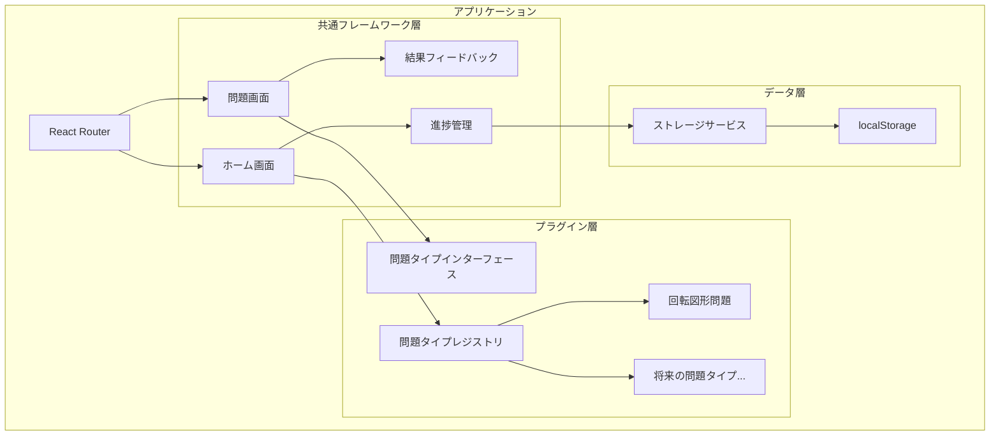
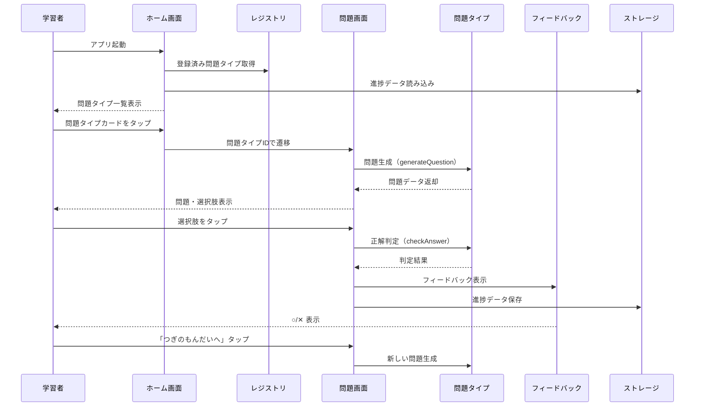
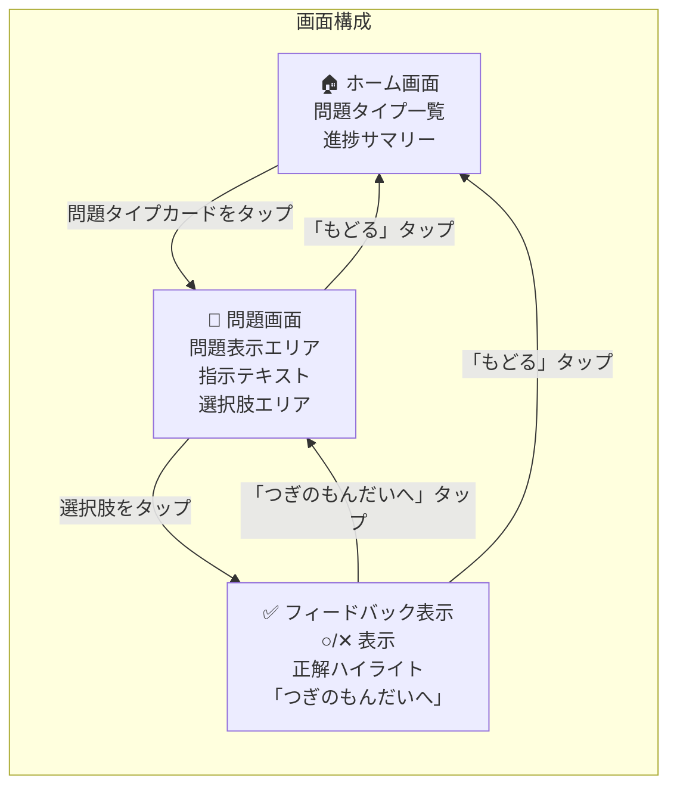
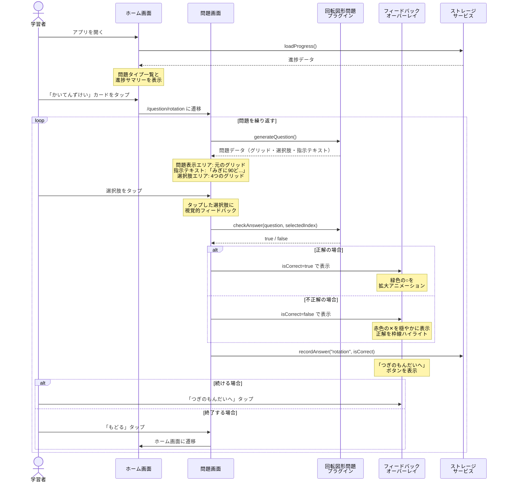
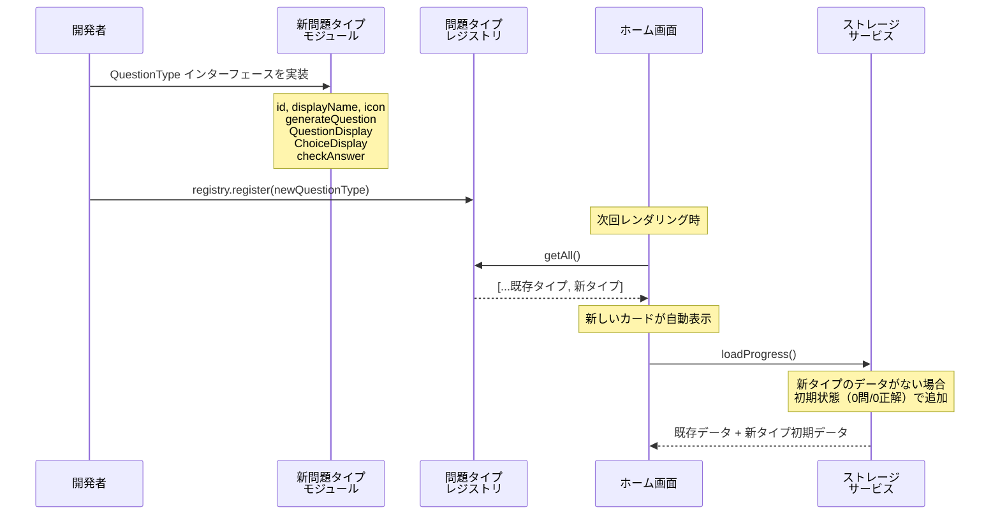
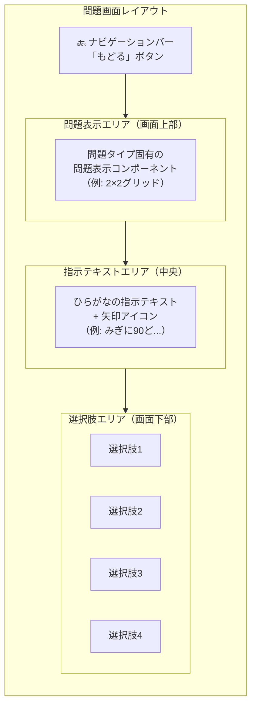
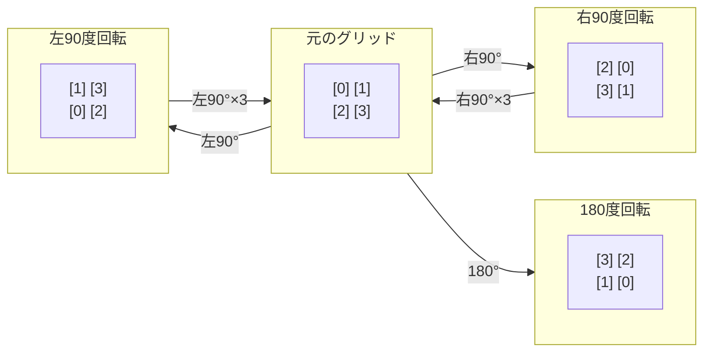
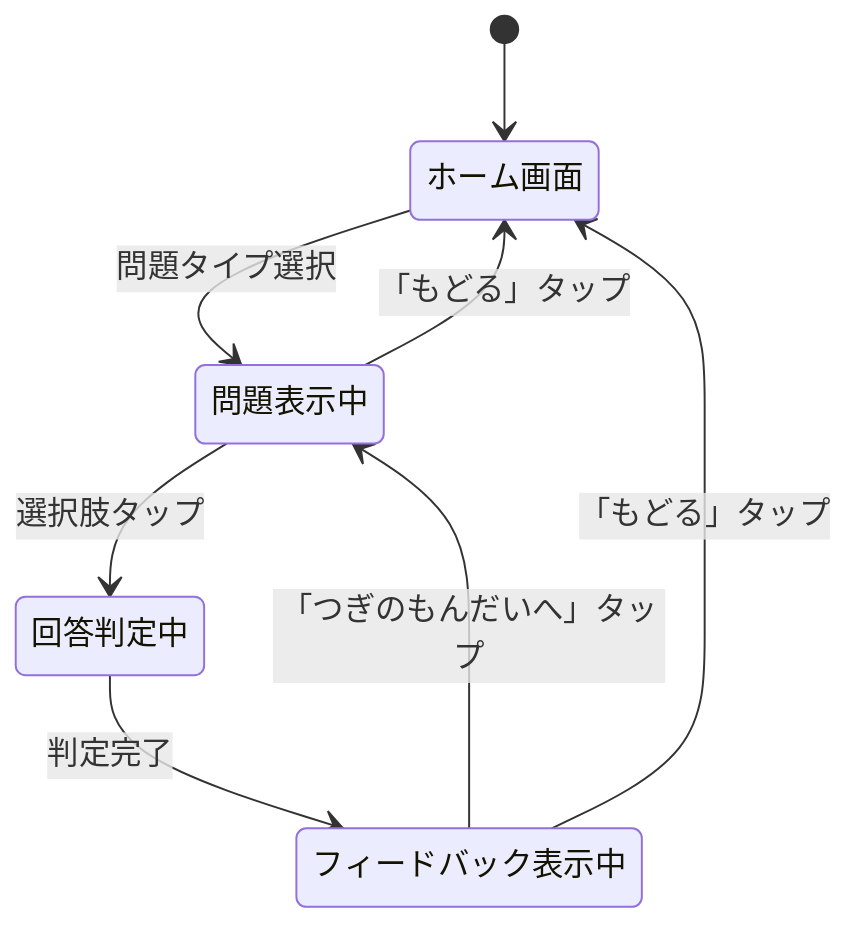

# 設計ドキュメント: 小学校受験問題練習アプリ

## 概要（Overview）

本アプリケーションは、国立小学校受験レベルの問題を幼稚園児が練習できるブラウザベースのSPA（Single Page Application）である。React + TypeScript で構築し、サーバサイドを必要としない完全なフロントエンドアプリケーションとして動作する。

### 設計思想

1. **プラグインアーキテクチャ**: 問題タイプを独立したモジュールとして実装し、共通フレームワークから分離する
2. **幼稚園児ファースト**: すべてのUI/UXは幼稚園児が直感的に操作できることを最優先とする
3. **段階的拡張**: 初回リリースでは回転図形問題のみを実装し、アプリの骨格とUXを確立する
4. **オフライン完結**: localStorage によるデータ永続化のみを使用し、ネットワーク通信を一切行わない

### 技術スタック

| カテゴリ | 技術 | 理由 |
|---------|------|------|
| フレームワーク | React 18+ | コンポーネントベースのUI構築、豊富なエコシステム |
| 言語 | TypeScript | 型安全性によるプラグインインターフェースの厳密な定義 |
| ビルドツール | Vite | 高速な開発サーバーとビルド |
| スタイリング | CSS Modules | コンポーネントスコープのスタイル、追加依存なし |
| ルーティング | React Router v6 | SPA内のページ遷移 |
| テスト | Vitest + React Testing Library | Viteとの統合、高速なテスト実行 |
| PBTライブラリ | fast-check | TypeScript対応のプロパティベーステスト |

---

## アーキテクチャ（Architecture）

### High-Level アーキテクチャ



### Low-Level アーキテクチャ: データフロー



### 画面遷移図



### ユーザー操作フロー: 問題に回答する



### ユーザー操作フロー: 新しい問題タイプの追加（開発者向け）



### ディレクトリ構成

```
src/
├── main.tsx                          # エントリポイント
├── App.tsx                           # ルーティング設定
├── types/
│   └── question.ts                   # 問題タイプインターフェース定義
├── registry/
│   └── questionTypeRegistry.ts       # 問題タイプレジストリ
├── framework/
│   ├── components/
│   │   ├── HomeScreen.tsx            # ホーム画面
│   │   ├── QuestionScreen.tsx        # 問題画面（共通レイアウト）
│   │   ├── FeedbackOverlay.tsx       # 結果フィードバック表示
│   │   ├── QuestionTypeCard.tsx      # 問題タイプカード
│   │   └── NavigationBar.tsx         # ナビゲーションバー
│   └── hooks/
│       ├── useProgress.ts            # 進捗データ管理フック
│       └── useQuestionFlow.ts        # 問題出題フロー管理フック
├── storage/
│   └── storageService.ts             # localStorage操作サービス
├── plugins/
│   └── rotation/
│       ├── index.ts                  # 問題タイプ登録エントリ
│       ├── rotationQuestion.ts       # 問題生成・正解判定ロジック
│       ├── components/
│       │   ├── GridDisplay.tsx        # グリッド表示コンポーネント
│       │   ├── QuestionDisplay.tsx    # 問題表示コンポーネント
│       │   └── ChoicesDisplay.tsx     # 選択肢表示コンポーネント
│       └── types.ts                  # 回転図形問題固有の型定義
└── styles/
    ├── global.css                    # グローバルスタイル・テーマ
    └── variables.css                 # CSS変数（配色・サイズ）
```

---

## コンポーネントとインターフェース（Components and Interfaces）

### 問題タイプインターフェース（コアインターフェース）

```typescript
// types/question.ts

/** 問題タイプの一意な識別子 */
type QuestionTypeId = string;

/** 選択肢のインデックス（0始まり） */
type ChoiceIndex = number;

/** 問題データ（問題タイプごとに異なる） */
interface Question<TQuestionData = unknown, TChoiceData = unknown> {
  /** 問題固有のデータ */
  questionData: TQuestionData;
  /** 選択肢データの配列 */
  choices: TChoiceData[];
  /** 正解の選択肢インデックス */
  correctIndex: ChoiceIndex;
  /** ひらがなの指示テキスト */
  instructionText: string;
}

/** 問題タイプの定義 */
interface QuestionType<TQuestionData = unknown, TChoiceData = unknown> {
  /** 一意の識別子 */
  id: QuestionTypeId;
  /** 表示名（ひらがな） */
  displayName: string;
  /** アイコン（絵文字またはSVGコンポーネント） */
  icon: string | React.ComponentType;
  /** 問題を生成する関数 */
  generateQuestion: () => Question<TQuestionData, TChoiceData>;
  /** 問題表示コンポーネント */
  QuestionDisplay: React.ComponentType<{ data: TQuestionData }>;
  /** 選択肢表示コンポーネント */
  ChoiceDisplay: React.ComponentType<{
    data: TChoiceData;
    isSelected: boolean;
    isCorrect: boolean;
    showResult: boolean;
  }>;
  /** 正解判定関数 */
  checkAnswer: (
    question: Question<TQuestionData, TChoiceData>,
    selectedIndex: ChoiceIndex
  ) => boolean;
}
```

### 問題タイプレジストリ

```typescript
// registry/questionTypeRegistry.ts

class QuestionTypeRegistry {
  private types: Map<QuestionTypeId, QuestionType> = new Map();

  /** 問題タイプを登録する */
  register(questionType: QuestionType): void;

  /** IDで問題タイプを取得する */
  get(id: QuestionTypeId): QuestionType | undefined;

  /** 登録済みの全問題タイプを取得する */
  getAll(): QuestionType[];

  /** 問題タイプが登録済みか確認する */
  has(id: QuestionTypeId): boolean;
}

/** シングルトンインスタンス */
export const registry = new QuestionTypeRegistry();
```

### ストレージサービス

```typescript
// storage/storageService.ts

interface ProgressData {
  /** 問題タイプごとの進捗 */
  byType: Record<QuestionTypeId, TypeProgress>;
  /** 最終更新日時 */
  lastUpdated: string;
}

interface TypeProgress {
  /** 累計問題数 */
  totalQuestions: number;
  /** 累計正答数 */
  correctAnswers: number;
}

class StorageService {
  private readonly STORAGE_KEY = 'exam-app-progress';

  /** 進捗データを読み込む */
  loadProgress(): ProgressData;

  /** 進捗データを保存する */
  saveProgress(data: ProgressData): boolean;

  /** 回答結果を記録する（問題タイプID、正解かどうか） */
  recordAnswer(typeId: QuestionTypeId, isCorrect: boolean): boolean;

  /** 全体の累計を計算する */
  getTotalProgress(data: ProgressData): TypeProgress;

  /** 進捗データをリセットする */
  resetProgress(): boolean;
}

export const storageService = new StorageService();
```

### フレームワークコンポーネント

#### 問題画面のレイアウト構成



#### HomeScreen

```typescript
// framework/components/HomeScreen.tsx

interface HomeScreenProps {
  // React Router経由でナビゲーション
}

/**
 * ホーム画面コンポーネント
 * - レジストリから問題タイプ一覧を取得して表示
 * - 全体の進捗サマリーを表示
 * - 問題タイプカードのタップで問題画面に遷移
 */
const HomeScreen: React.FC<HomeScreenProps>;
```

#### QuestionScreen

```typescript
// framework/components/QuestionScreen.tsx

interface QuestionScreenProps {
  // React Router経由でquestionTypeIdを取得
}

/**
 * 問題画面コンポーネント（共通フレームワーク）
 * - 3領域レイアウト: 問題表示エリア / 指示テキスト / 選択肢エリア
 * - 問題タイプのコンポーネントを動的に描画
 * - 回答処理とフィードバック表示を管理
 */
const QuestionScreen: React.FC<QuestionScreenProps>;
```

#### FeedbackOverlay

```typescript
// framework/components/FeedbackOverlay.tsx

interface FeedbackOverlayProps {
  /** 正解かどうか */
  isCorrect: boolean;
  /** 表示中かどうか */
  visible: boolean;
  /** 「つぎのもんだいへ」ボタンのコールバック */
  onNext: () => void;
}

/**
 * 結果フィードバックオーバーレイ
 * - 正解: 緑色の○を拡大アニメーション（0.3秒以上）で表示
 * - 不正解: 赤色の✕を穏やかに表示
 * - 「つぎのもんだいへ」ボタンを表示
 */
const FeedbackOverlay: React.FC<FeedbackOverlayProps>;
```

### 回転図形問題プラグイン

#### Low-Level: 回転ロジック

```typescript
// plugins/rotation/rotationQuestion.ts

/** 2×2グリッドの型（[上左, 上右, 下左, 下右]） */
type Grid = [boolean, boolean, boolean, boolean];

/** 回転方向 */
type RotationDirection = 'right90' | 'left90' | 'rotate180';

/** 回転図形問題の問題データ */
interface RotationQuestionData {
  /** 元のグリッドパターン */
  originalGrid: Grid;
  /** 回転方向 */
  direction: RotationDirection;
}

/** 回転図形問題の選択肢データ */
type RotationChoiceData = Grid;

/** グリッドを右90度回転する */
function rotateRight90(grid: Grid): Grid;

/** グリッドを左90度回転する */
function rotateLeft90(grid: Grid): Grid;

/** グリッドを180度回転する */
function rotate180(grid: Grid): Grid;

/** 指定方向にグリッドを回転する */
function rotateGrid(grid: Grid, direction: RotationDirection): Grid;

/** 有効なランダムグリッドを生成する（1つ以上塗り＆1つ以上空白） */
function generateRandomGrid(): Grid;

/** 不正解の選択肢を生成する（正解・他の不正解と重複しない） */
function generateDistractors(correctGrid: Grid, count: number): Grid[];

/** 2つのグリッドが同一か判定する */
function gridsEqual(a: Grid, b: Grid): boolean;

/** 問題を生成する */
function generateRotationQuestion(): Question<RotationQuestionData, RotationChoiceData>;
```

#### Low-Level: 回転アルゴリズム

2×2グリッドのインデックスマッピング:

```
グリッド配列: [0, 1, 2, 3]
表示位置:
  [0] [1]
  [2] [3]

右90度回転: [2, 0, 3, 1]  （列を下から上に読む）
左90度回転: [1, 3, 0, 2]  （列を上から下に読む）
180度回転:  [3, 2, 1, 0]  （逆順）
```



```typescript
function rotateRight90(grid: Grid): Grid {
  return [grid[2], grid[0], grid[3], grid[1]];
}

function rotateLeft90(grid: Grid): Grid {
  return [grid[1], grid[3], grid[0], grid[2]];
}

function rotate180(grid: Grid): Grid {
  return [grid[3], grid[2], grid[1], grid[0]];
}
```

#### 不正解選択肢の生成戦略

不正解の選択肢は以下の方法で生成する:

1. 正解以外の回転結果（他の回転方向の結果）を候補に含める
2. ランダムに有効なグリッドを生成する
3. 正解および既存の不正解と重複しないことを確認する
4. 3つの不正解が揃うまで繰り返す

---

## データモデル（Data Models）

### 進捗データ（localStorage）

```json
{
  "exam-app-progress": {
    "byType": {
      "rotation": {
        "totalQuestions": 15,
        "correctAnswers": 10
      }
    },
    "lastUpdated": "2024-01-15T10:30:00.000Z"
  }
}
```

### 問題データ（ランタイム）

```typescript
// 回転図形問題の生成例
{
  questionData: {
    originalGrid: [true, false, true, false],  // ■□■□
    direction: 'right90'
  },
  choices: [
    [false, true, false, true],   // 不正解1
    [true, true, false, false],   // 正解（右90度回転結果）
    [false, false, true, true],   // 不正解2
    [true, false, false, true]    // 不正解3
  ],
  correctIndex: 1,
  instructionText: 'みぎに90どかいてんさせると\nどれになりますか？'
}
```

### アプリケーション状態（ランタイム）

```typescript
/** 問題画面の状態 */
interface QuestionScreenState {
  /** 現在の問題タイプ */
  questionType: QuestionType;
  /** 現在の問題 */
  currentQuestion: Question;
  /** 選択された選択肢のインデックス（未選択はnull） */
  selectedIndex: ChoiceIndex | null;
  /** 回答済みかどうか */
  isAnswered: boolean;
  /** 正解かどうか（回答後に設定） */
  isCorrect: boolean | null;
}
```

### 状態遷移図



---

## 正当性プロパティ（Correctness Properties）

*プロパティとは、システムのすべての有効な実行において成り立つべき特性や振る舞いのことである。人間が読める仕様と機械的に検証可能な正当性保証の橋渡しとなる形式的な記述である。*

### Property 1: レジストリの登録・取得ラウンドトリップ

*任意の*有効な問題タイプオブジェクト（id, displayName, icon, generateQuestion, QuestionDisplay, ChoiceDisplay, checkAnswer を持つ）に対して、レジストリに登録した後に同じIDで取得すると、登録したオブジェクトと同一のオブジェクトが返される。

**Validates: Requirements 1.2, 1.5**

### Property 2: 進捗表示フォーマットの正確性

*任意の*非負整数の正答数 c と問題数 t（c ≤ t）に対して、進捗表示関数は「{c}もんせいかい / {t}もんちゅう」の形式の文字列を返す。

**Validates: Requirements 2.3**

### Property 3: 進捗データの記録・読み込みラウンドトリップ

*任意の*問題タイプIDのリストと各タイプに対する回答シーケンス（正解/不正解の列）に対して、recordAnswerで記録した後にloadProgressで読み込むと、各問題タイプの累計問題数と累計正答数が回答シーケンスと一致する。

**Validates: Requirements 5.1, 5.2**

### Property 4: 新問題タイプ追加時の既存データ保持

*任意の*既存の進捗データに対して、新しい問題タイプの進捗を初期状態で追加した後、既存の問題タイプの進捗データ（問題数、正答数）は変更されない。

**Validates: Requirements 5.6**

### Property 5: グリッド生成の有効性

*任意の*generateRandomGrid関数の呼び出し結果に対して、返されるグリッドは長さ4のboolean配列であり、少なくとも1つのtrueと少なくとも1つのfalseを含む。

**Validates: Requirements 6.2, 6.3**

### Property 6: 回転方向と指示テキストの整合性

*任意の*generateRotationQuestion関数の呼び出し結果に対して、問題データのdirectionフィールドは'right90'、'left90'、'rotate180'のいずれかであり、instructionTextはそのdirectionに対応するひらがなの指示文を含む。

**Validates: Requirements 6.4**

### Property 7: 問題生成の選択肢の正当性

*任意の*generateRotationQuestion関数の呼び出し結果に対して、選択肢は正確に4つあり、すべて互いに異なり、correctIndexは0〜3の範囲であり、choices[correctIndex]は元のグリッドを指定方向に回転した結果と一致する。

**Validates: Requirements 6.5, 6.6, 6.7**

### Property 8: 右90度回転4回のラウンドトリップ

*任意の*有効なグリッドパターンに対して、右90度回転を4回連続で適用した結果は元のパターンと一致する。

**Validates: Requirements 7.4**

### Property 9: 右90度回転と左90度回転の逆操作

*任意の*有効なグリッドパターンに対して、右90度回転の後に左90度回転を適用した結果は元のパターンと一致する。また、左90度回転の後に右90度回転を適用した結果も元のパターンと一致する。

**Validates: Requirements 7.5**

### Property 10: 180度回転は右90度回転2回と等価

*任意の*有効なグリッドパターンに対して、180度回転の結果は右90度回転を2回適用した結果と一致する。

**Validates: Requirements 7.3**

---

## エラーハンドリング（Error Handling）

### localStorage関連のエラー

| エラー状況 | 対応方針 | 根拠 |
|-----------|---------|------|
| localStorage未対応ブラウザ | 進捗保存なしで動作継続。問題出題は正常に行う | 要件5.5 |
| localStorage容量超過 | 保存失敗を無視し、問題出題を継続 | 要件5.5 |
| localStorageデータ破損 | 初期状態にリセットして起動 | 要件5.4の拡張 |
| JSON解析エラー | 初期状態にリセットして起動 | 堅牢性 |

### 問題生成関連のエラー

| エラー状況 | 対応方針 | 根拠 |
|-----------|---------|------|
| 不正解選択肢の生成失敗（無限ループ防止） | 最大試行回数（100回）を設定し、超過時はランダムグリッドで埋める | 堅牢性 |
| 未登録の問題タイプIDでのアクセス | ホーム画面にリダイレクト | 堅牢性 |

### エラーハンドリングの実装方針

```typescript
// storage/storageService.ts

loadProgress(): ProgressData {
  try {
    const raw = localStorage.getItem(this.STORAGE_KEY);
    if (!raw) return this.getInitialProgress();
    const parsed = JSON.parse(raw);
    return this.validateProgressData(parsed) 
      ? parsed 
      : this.getInitialProgress();
  } catch {
    return this.getInitialProgress();
  }
}

saveProgress(data: ProgressData): boolean {
  try {
    localStorage.setItem(this.STORAGE_KEY, JSON.stringify(data));
    return true;
  } catch {
    // 要件5.5: エラーを表示せずに継続
    return false;
  }
}
```

---

## テスト戦略（Testing Strategy）

### テストの全体方針

本アプリケーションでは、**ユニットテスト**と**プロパティベーステスト**の二本柱でテストを行う。

- **ユニットテスト**: 具体的な例、エッジケース、UIインタラクションの検証
- **プロパティベーステスト**: 普遍的な性質の検証（回転ロジック、データ永続化、問題生成）

### テストツール

| ツール | 用途 |
|-------|------|
| Vitest | テストランナー |
| React Testing Library | UIコンポーネントテスト |
| fast-check | プロパティベーステスト |

### プロパティベーステスト

プロパティベーステストは `fast-check` ライブラリを使用し、各テストは最低100回のイテレーションで実行する。

各テストには以下のタグ形式でコメントを付与する:
```
// Feature: elementary-exam-app, Property {number}: {property_text}
```

#### 対象プロパティ一覧

| Property | テスト対象 | テスト内容 |
|----------|-----------|-----------|
| Property 1 | QuestionTypeRegistry | 登録→取得のラウンドトリップ |
| Property 2 | 進捗表示関数 | フォーマット文字列の正確性 |
| Property 3 | StorageService | recordAnswer→loadProgressのラウンドトリップ |
| Property 4 | StorageService | 新問題タイプ追加時の既存データ不変 |
| Property 5 | generateRandomGrid | 生成グリッドの有効性（制約充足） |
| Property 6 | generateRotationQuestion | 回転方向と指示テキストの整合性 |
| Property 7 | generateRotationQuestion | 選択肢の正当性（4つ一意、正解含む） |
| Property 8 | rotateRight90 | 4回適用のラウンドトリップ |
| Property 9 | rotateRight90 / rotateLeft90 | 逆操作のラウンドトリップ |
| Property 10 | rotate180 / rotateRight90 | 180度回転 = 右90度×2 |

### ユニットテスト

#### UIコンポーネントテスト（React Testing Library）

| テスト対象 | テスト内容 | 対応要件 |
|-----------|-----------|---------|
| HomeScreen | 問題タイプ一覧の表示 | 2.1, 2.2 |
| HomeScreen | 進捗サマリーの表示 | 2.3 |
| HomeScreen | カードタップで問題画面に遷移 | 2.4 |
| QuestionScreen | 3領域レイアウトの構成 | 3.1 |
| QuestionScreen | 問題・選択肢コンポーネントの描画 | 3.2, 3.3 |
| QuestionScreen | 指示テキストの表示 | 3.4 |
| QuestionScreen | 選択肢タップで正解判定 | 3.5 |
| FeedbackOverlay | 正解時の○表示 | 4.1 |
| FeedbackOverlay | 不正解時の✕表示と正解ハイライト | 4.2, 4.3 |
| FeedbackOverlay | 「つぎのもんだいへ」ボタン | 4.4, 4.6 |
| FeedbackOverlay | フィードバック中の選択肢無効化 | 4.5 |
| NavigationBar | 戻るボタンの表示と動作 | 2.5 |

#### エッジケーステスト

| テスト対象 | テスト内容 | 対応要件 |
|-----------|-----------|---------|
| StorageService | localStorage未対応時の動作 | 5.5 |
| StorageService | データ未存在時の初期状態 | 5.4 |
| StorageService | データ破損時のリカバリ | エラーハンドリング |

#### アクセシビリティテスト

| テスト対象 | テスト内容 | 対応要件 |
|-----------|-----------|---------|
| 全インタラクティブ要素 | タップ領域 ≥ 44×44px | 2.6, 8.4 |
| GridDisplay | コントラスト比 ≥ 4.5:1 | 8.5 |
| 全テキスト要素 | フォントサイズ ≥ 16px | 10.6 |

### テストディレクトリ構成

```
src/
├── __tests__/
│   ├── registry/
│   │   └── questionTypeRegistry.test.ts
│   ├── storage/
│   │   └── storageService.test.ts
│   ├── framework/
│   │   ├── HomeScreen.test.tsx
│   │   ├── QuestionScreen.test.tsx
│   │   └── FeedbackOverlay.test.tsx
│   └── plugins/
│       └── rotation/
│           ├── rotationQuestion.test.ts      # ユニットテスト
│           └── rotationQuestion.property.test.ts  # プロパティテスト
├── __tests__/properties/
│   ├── registry.property.test.ts
│   ├── storage.property.test.ts
│   └── rotation.property.test.ts
```

